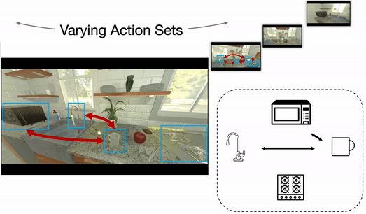
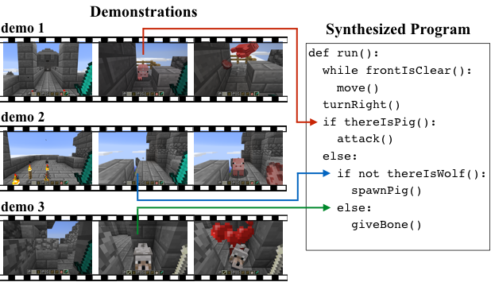
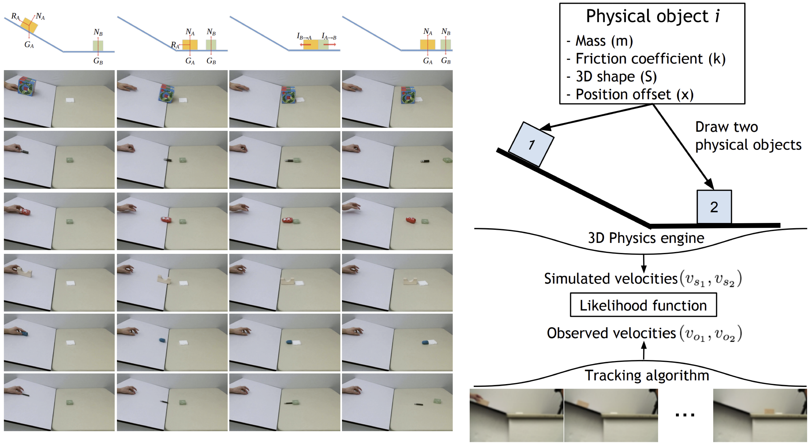
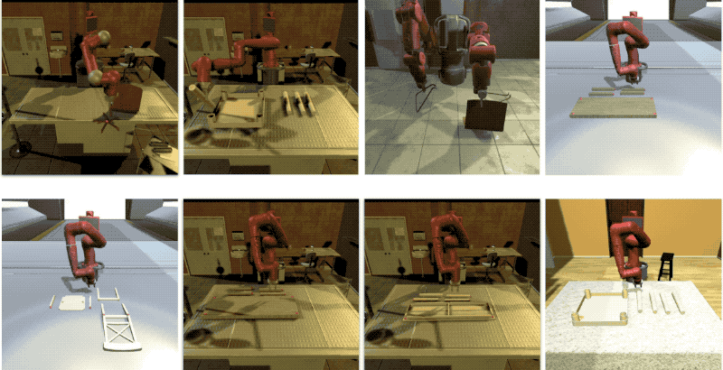
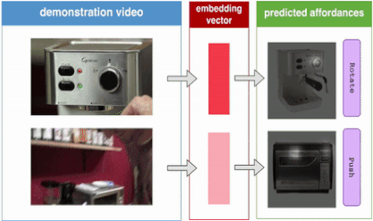
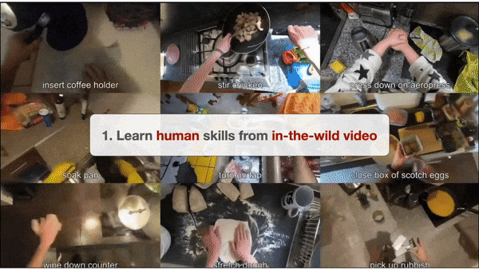

---
# You don't need to edit this file, it's empty on purpose.
# Edit theme's home layout instead if you wanna make some changes
# See: https://jekyllrb.com/docs/themes/#overriding-theme-defaults
layout: home
order: 0
---

   

  

        

	 
        

        

        <h4 style='text-align: left;'>
        Welcome to CLVR group!
        </h4>

        

        We are <b>Cognitive Learning for Vision and Robotics (CLVR, pronounced 'clever')</b> group at Korea Advanced Institute of Science and Technology (KAIST) led by Joseph J. Lim (임재환).
        Our goal is to develop intelligent systems that are capable of perceiving, reasoning, and interacting with the world.
        The research topics include cognitive model (incorporating generalizable problem-solving and relation decision-making), symbolic manipulation, visual perception, and robot learning.
        

         
        <h4 style='text-align: left;'>
        <a href="#news" style='color: inherit;'>Recent News</a>
        </h4>
        <b>[Talk]</b> Joseph J. Lim gives <a style='color: inherit;' href='https://youtu.be/aljMiB3ciHE'>a talk at <b>CoRL</b></a>! (2022)
	 
        <b>[Paper]</b> Two papers are accepted to <b>CoRL</b>! (2022)
         
        <b>[Paper]</b> Three papers are accepted to <b>ICLR</b>! (2022)
         
        

    

     
        <h4 style='text-align: left;'>
        <b>Research Topics</b> (<a href='/publications'>more</a>)
        </h4>
         
    

        

        
            

         <b>Cognitive Model</b>
	 (Domain/Action Generalization)
        

        

        

        
            

         <b>Symbolic Manipulation</b>
	 (Neural Program Synthesis)
        

        

        

        
            

         <b>Logical Reasoning</b>
	 (Physics Understanding)
        

        

    

      
    

        

        
            

         <b>Robot Learning</b>
	 (Complex Long-Horizon Manipulation)
        

        

        

        
            

         <b>Computer Vision</b>
	 (Learning from Video)
        

        

        

        
            

         <b>Reinforcement Learning</b>
	 (Skill-based Reinforcement Learning)
        

        

    

   
  

    <h4 style='text-align:left;'><b> News </b></h4>
	  <h5 style='text-align:left;'> 2023 </h5>
      <ul>
        <li>
          <b>[PhD Defense]</b> Karl Pertsch successfully defended his PhD thesis!
        </li>
      </ul>

	  <h5 style='text-align:left;'> 2022 </h5>
	  <ul>
	    <li>
              <b>[Talk]</b> Joseph J. Lim gives <a style='color: inherit;' href='https://youtu.be/aljMiB3ciHE'>a talk at <b>CoRL</b></a>!
	    </li>
	    <li>
	      <b>[Paper]</b> Two papers are accepted to <b>CoRL</b>!
	    </li>
	    <li>
	      <b>[Paper]</b> Three papers are accepted to <b>ICLR</b>!
	    </li>
        <li>
          <b>[PhD Defense]</b> Youngwoon Lee successfully defended his PhD thesis!
        </li>
        <li>
          <b>[PhD Defense]</b> Shao-Hua Sun successfully defended his PhD thesis!
        </li>
	  </ul>

	  <h5 style='text-align:left;'> 2021 </h5>
	  <ul>
	    <li>
	      <b>[Paper]</b> Two papers are accepted to <b>NeurIPS</b>!
	    </li>
	    <li>
	      <b>[Paper]</b> Three papers are accepted to <b>CoRL</b>!
	    </li>
	    <li>
	      <b>[Paper]</b> Our paper on policy transfer across visual and dynamics gaps is accepted to <b>RSS</b>!
	    </li>
	    <li>
	      <b>[Paper]</b> One paper is accepted to <b>ICML</b>!
	    </li>
	    <li>
	      <b>[Paper]</b> Our <a href='https://clvrai.com/furniture' style='color: inherit;'>IKEA Furniture Assembly Environment</a> is accepted to <b>ICRA</b>!
	    </li>
	  </ul>

	  <h5 style='text-align:left;'> 2020 </h5>
	  <ul>
	    <li>
	      <b>[Award]</b> <a href='https://clvrai.com/spirl' style='color: inherit;'>SPiRL</a> is selected as a plenary talk and won the best paper presentation award at <b>CoRL</b>!
	    </li>
	    <li>
	      <b>[Paper]</b> Two papers are accepted to <b>CoRL</b>!
	    </li>
	    <li>
	      <b>[Paper]</b> Paper on generalization to new actions is accepted to <b>ICML</b>!
	    </li>
	    <li>
	      <b>[Paper]</b> Two papers are accepted to <b>ICLR</b>!
	    </li>
	    <li>
	      <b>[Release]</b> We released <a href='https://clvrai.com/furniture' style='color: inherit;'>IKEA Furniture Assembly Environment</a> for a complex robot manipulation benchmark.
	    </li>
	  </ul>

	  <h5 style='text-align:left;'> 2019 </h5>
	  <ul>
	    <li>
	      <b>[Paper]</b> Our paper on imitation learning from observation is accepted to <b>CoRL</b>!
	    </li>
	    <li>
	      <b>[Paper]</b> Our paper on multimodal meta-learning is accepted to <b>NeurIPS</b>!
	    </li>
	    <li>
	      <b>[Talk]</b> <a style='color: inherit;' href='https://people.eecs.berkeley.edu/~pathak/' target='_blank'>Deepak Pathak</a> from UC Berkeley gave a talk as part of the CLVR Speaker Series.
	    </li>
	    <li>
	      <b>[Paper]</b> Paper on complex skill composition accepted to <b>ICLR 2019</b>!
	    </li>
	    <li>
	      <b>[Talk]</b> <a style='color: inherit;' href='https://ai.stanford.edu/~kuanfang/' target='_blank'>Kuan Fang</a> from the Stanford Vision Lab gave a talk as part of the CLVR Speaker Series.
	    </li>
	    <li>
	      <b>[Talk]</b> <a style='color: inherit;' href='https://www.tshu.io/' target='_blank'>Tianmin Shu</a> from UCLA gave a talk as part of the CLVR Speaker Series.
	    </li>
	    <li>
	      <b>[Talk]</b> <a style='color: inherit;' href='https://web.stanford.edu/~yukez/' target='_blank'>Yuke Zhu</a> from the Stanford Vision Lab gave a talk as part of the CLVR Speaker Series.
	    </li>
	    <li>
	      <b>[Talk]</b> <a style='color: inherit;' href='http://andrewowens.com/' target='_blank'>Andrew Owens</a> from UC Berkeley gave a talk as part of the CLVR Speaker Series.
	    </li>
	  </ul>

	  <h5 style='text-align: left;'> 2018 </h5>
	  <ul>
	    <li>
	      <b>[Paper]</b> Paper on novel-view synthesis accepted to <b>ECCV</b>!
	    </li>
	    <li>
	      <b>[Paper]</b> Paper on neural program synthesis accepted to <b>ICML</b>!
	    </li>
	    <li>
	      <b>[Talk]</b> <a style='color: inherit;' href='https://jiajunwu.com/' target='_blank'>Jiajun Wu</a> from MIT gave a talk as part of the CLVR Speaker Series.
	    </li>
	    <li>
	      <b>[Paper]</b> Paper on object affordance reasoning accepted to <b>CVPR</b>!
	    </li>
	    <li>
	      <b>[Talk]</b> <a style='color: inherit;' href='http://carlvondrick.com/' target='_blank'>Carl Vondrick</a> from Google gave a talk as part of the CLVR Speaker Series.
	    </li>
	    <li>
	      <b>[Paper]</b> Paper on agents that disentangle environment and task accepted to <b>ICLR</b>!
	    </li>
	    <li>
	      <b>[Talk]</b> <a style='color: inherit;' href='https://jimmylba.github.io/' target='_blank'>Jimmy Ba</a> from UToronto gave a talk as part of the CLVR Speaker Series.
	    </li>
	    <li>
	      <b>[Talk]</b> <a style='color: inherit;' href='https://people.eecs.berkeley.edu/~isola/' target='_blank'>Phillip Isola</a> from OpenAI gave a talk as part of the CLVR Speaker Series.
	    </li>
	  </ul>

	  <h5 style='text-align: left;'> 2017 </h5>
	  <ul>
	    <li>
	      <b>[Paper]</b> Paper on multi-modal imitation learning accepted to <b>NIPS</b>!
	    </li>
	  </ul>
	   
  

