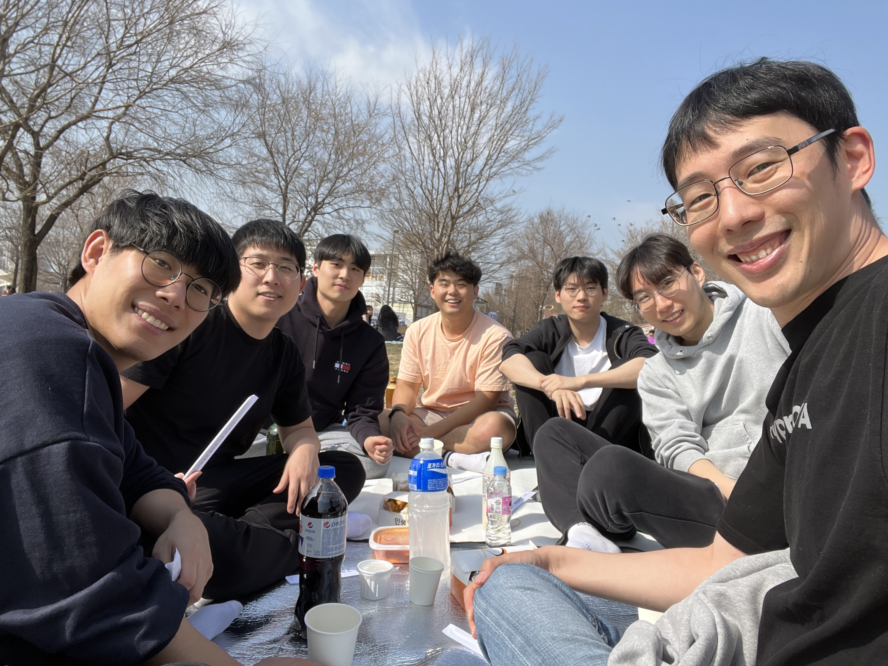
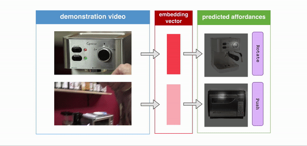
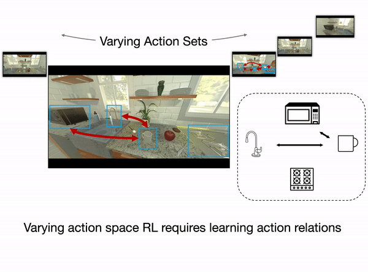

---
# You don't need to edit this file, it's empty on purpose.
# Edit theme's home layout instead if you wanna make some changes
# See: https://jekyllrb.com/docs/themes/#overriding-theme-defaults
layout: home
order: 0
---

   

  

        

        
        

        

        <h4 style='text-align: left;'>
        Welcome!
        </h4>

        

        We are <b>Cognitive Learning for Vision and Robotics (CLVR)</b> group at Korea Advanced Institute of Science and Technology (KAIST) led by Joseph J. Lim (임재환).
        Our goal is to develop intelligent systems that are capable of perceiving, reasoning, and interacting with the world.
        The research topics include cognitive model (incorporating generalizable problem-solving and relation decision-making), symbolic manipulation, visual perception, and robot learning.
        

         
        <h4 style='text-align: left;'>
        Recent News (<a href='/news'>more</a>)
        </h4>
        <b>[Talk]</b> Joseph Lim gives a talk at <b>CoRL</b>! (2022)
         
            <b>[Paper]</b> Three papers are accepted to <b>ICLR</b>! (2022)
        

    

       
        <h4 style='text-align: left;'>
        Research Topics (<a href='/research'>more</a>)
        </h4>
    

        

        
            

         <b>Robot Learning</b>
        

        

        

        
            

         <b>Computer Vision</b>
        

        

        

        
            

         <b>Cognitive Model</b>
        

        

    

      
    

        

        
            

         <b>Symbolic Manipulation</b>
        

        

        

        
            

         <b>Reasoning and Planning</b>
        

        

        

        
            

         <b>Benchmark</b>
        

        

    

